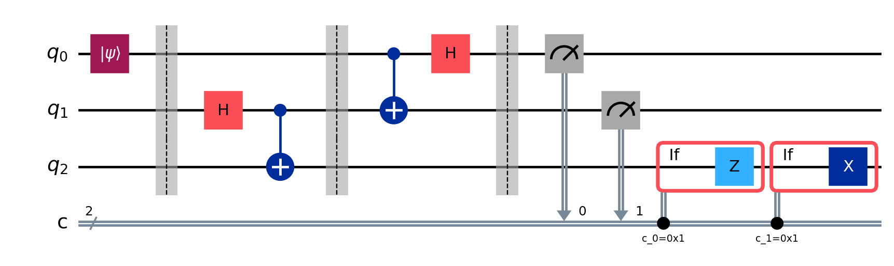

# Quantum Teleportation Simulator

[](https://opensource.org/licenses/MIT)
[](https://www.python.org/)
[](https://github.com/Qiskit/qiskit)

A Python simulation of the **quantum teleportation protocol** built with [Qiskit](https://github.com/Qiskit/qiskit): Alice sends the unknown state of a qubit to Bob using only a shared entangled pair (an EPR pair) and two classical bits. The project checks that the teleportation worked by computing the **fidelity** between Alice's original state and Bob's final state.

<p align="center">
  
</p>

## 📖 The protocol in brief

The circuit uses three qubits: `q0` holds the state to teleport, $|\psi\rangle = \alpha|0\rangle + \beta|1\rangle$, while `q1` and `q2` will form the EPR pair $|\Phi^+\rangle = (|00\rangle + |11\rangle)/\sqrt{2}$. Alice controls `q0` and `q1`; Bob controls `q2`.

1. **State preparation:** `q0` is initialized to $|\psi\rangle$ (a random single-qubit state).
2. **EPR pair:** `q1` and `q2` are entangled with a Hadamard gate on `q1` followed by a CNOT `q1 → q2`.
3. **Bell measurement (Alice):** a CNOT `q0 → q1` followed by a Hadamard on `q0`.
4. **Measurement:** Alice measures `q0` and `q1`, obtaining two classical bits, `c0` and `c1`.
5. **Correction (Bob):** depending on the bits he receives, Bob applies $Z$ if `c0 = 1` and $X$ if `c1 = 1` to `q2`.

After steps 2 and 3, the global state of the three qubits is:

$$
\tfrac{1}{2}\Big[\|00\rangle(\alpha|0\rangle+\beta|1\rangle) + |01\rangle(\alpha|1\rangle+\beta|0\rangle) + |10\rangle(\alpha|0\rangle-\beta|1\rangle) + |11\rangle(\alpha|1\rangle-\beta|0\rangle)\Big]
$$

where the first two qubits are Alice's. Each measurement outcome leaves Bob with a version of $|\psi\rangle$ that can be fixed with a Pauli gate:

| `c0 c1` | Bob's state before correction | Correction |
|:-------:|:-----------------------------:|:----------:|
| `00`    | $\alpha\|0\rangle + \beta\|1\rangle$ | none |
| `01`    | $\alpha\|1\rangle + \beta\|0\rangle$ | $X$ |
| `10`    | $\alpha\|0\rangle - \beta\|1\rangle$ | $Z$ |
| `11`    | $\alpha\|1\rangle - \beta\|0\rangle$ | $Z$ and $X$ |

## ⚛️ Features

*   **Full protocol** with mid-circuit measurements and conditional corrections (`if_test`), i.e. a dynamic circuit with 3 qubits and 2 classical bits.
*   **Reproducible random state:** the state to teleport is generated with `random_statevector(2, seed=42)`.
*   **Quantitative verification:** the circuit's density matrix is saved, partially traced over Alice's qubits, and compared with the original state through the fidelity.
*   **Command-line interface** to run the simulation and save the circuit diagram.
*   **Explanatory notebook** that walks through the protocol step by step.

## 🚀 Getting started

### 🛠️ Requirements

*   **Python 3.12 or higher** (required by the pinned `numpy` and `scipy` versions in `requeriments.txt`).
*   Main dependencies: `qiskit`, `qiskit-aer`, `numpy`, `matplotlib` and `jupyterlab` (for the notebook).

### ⚙️ Installation

1.  **Clone the repository:**
    ```bash
    git clone https://github.com/acardiels/quantum_teleportation
    ```
2.  **Create and activate a virtual environment:**
    ```bash
    python3 -m venv venv
    source venv/bin/activate        # Windows: venv\Scripts\activate
    ```
3.  **Install the dependencies:**
    ```bash
    pip install -r requeriments.txt
    ```

## 💻 Usage

### Script

From the project root:

```bash
python src/quantum_teleportation.py            # run the simulation
python src/quantum_teleportation.py --save     # also save the circuit to images/
```

| Option    | Description                                                          | Default  |
|-----------|----------------------------------------------------------------------|:--------:|
| `--state` | Bell/EPR state used as the resource. Only `phi+` for now.            | `phi+`   |
| `--save`  | Saves the circuit diagram (PNG) in the `images/` folder.             | off      |

### Notebook

```bash
jupyter lab
```

Open `quantum_teleportation.ipynb`: it contains the same implementation split into cells, with the circuit drawn and the results checked.

### Example output

```text
==================================================
Quantum Teleportation Protocol
==================================================

Random Quantum State Ψ to teleport: |Ψ⟩ = α|0⟩ + β|1⟩
Quantum State Ψ — [ 0.18817376+0.4634306j ,-0.64222759+0.58083254j]
Bell State/ EPR State — phi+ (Φ+)

--- Qubit 0 state (Alice initial) ---
[ 0.18817376+0.4634306j ,-0.64222759+0.58083254j]

--- Qubit 2 state (Bob final - Density Matrix) ---
[ 0.18817376+0.4634306j ,-0.64222759+0.58083254j]


Fidelity: 1.000000
```

A fidelity of `1.0` means Bob's state matches the one Alice wanted to send.

## 🧩 How the code works

All functions live in `src/quantum_teleportation.py`:

| Function | What it does |
|----------|--------------|
| `build_bell_circuit(state)` | Builds the 2-qubit circuit that generates the Bell state $\|\Phi^+\rangle$ (Hadamard + CNOT). |
| `build_quantum_teleportation_circuit(quantum_state, epr_state)` | Assembles the full teleportation circuit with the measurements and conditional corrections. |
| `run_simulation(quantum_state, qc)` | Runs the circuit on `AerSimulator` (`statevector` method), obtains Bob's state via partial trace, and computes the fidelity. |
| `fix_global_phase(state_target, state_source)` | Aligns the global phase of Bob's state with the original so amplitudes can be compared (global phase does not affect the fidelity). |
| `draw_circuit(qc, output_path)` | Draws the circuit with Matplotlib and saves it as a PNG. |
| `generate_quantum_teleportation(...)` | Full pipeline: build, simulate and check the results. |

## 📂 Project structure

```text
quantum_teleportation/
├── src/
│   └── quantum_teleportation.py    # Implementation and CLI
├── images/                         # Circuit diagrams
│   └── quantum_teleportation_circuit.png
├── quantum_teleportation.ipynb     # Step-by-step Jupyter version
├── requeriments.txt                # Python dependencies
├── LICENSE
└── README.md
```

## 🔭 Future improvements

- [ ] Support all four Bell states (the notebook already defines how to prepare them; Bob's corrections would need adapting to each one).
- [ ] Let the user choose the state to teleport (or the seed) from the command line.
- [ ] Add an Aer noise model to study how the fidelity degrades.
- [ ] Run the circuit on real IBM quantum hardware.
- [ ] Add automated tests that check the fidelity for several states and seeds.

## 📚 References

*   C. H. Bennett, G. Brassard, C. Crépeau, R. Jozsa, A. Peres and W. K. Wootters, *Teleporting an unknown quantum state via dual classical and Einstein-Podolsky-Rosen channels*, Physical Review Letters **70**, 1895 (1993).
*   M. A. Nielsen and I. L. Chuang, *Quantum Computation and Quantum Information*, Cambridge University Press.
*   [Qiskit documentation](https://github.com/Qiskit/qiskit)

## 🤝 Contributing

Contributions are welcome! If you find bugs or have ideas to improve the simulation:

1.  Fork the project.
2.  Create a new branch (`git checkout -b feature/AmazingFeature`).
3.  Make your changes and commit them (`git commit -m 'feat: Added AmazingFeature'`).
4.  Push to the branch (`git push origin feature/AmazingFeature`).
5.  Open a Pull Request.

## 👤 Author

**Alejandro Cardiel Santos** — [GitHub](https://github.com/acardiels) · [LinkedIn](https://linkedin.com/in/alejandrocardiel)

## 📜 License

This project is distributed under the MIT license. See the `LICENSE` file for details.
